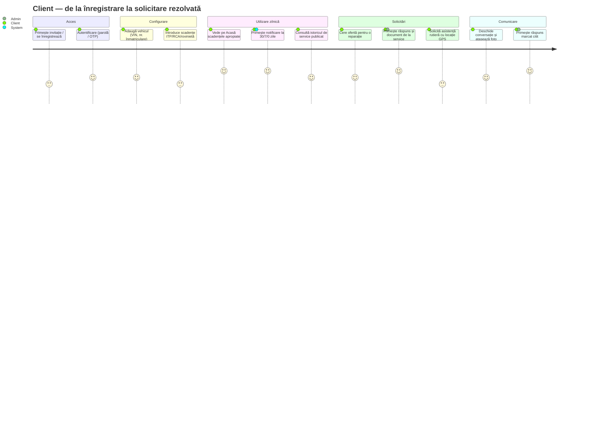
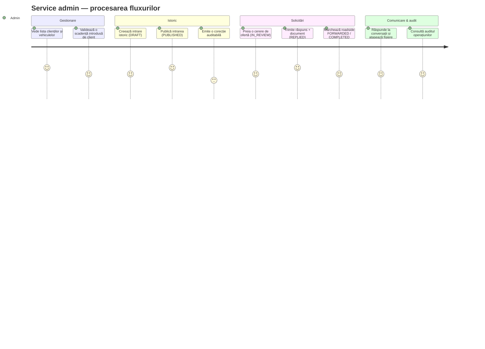
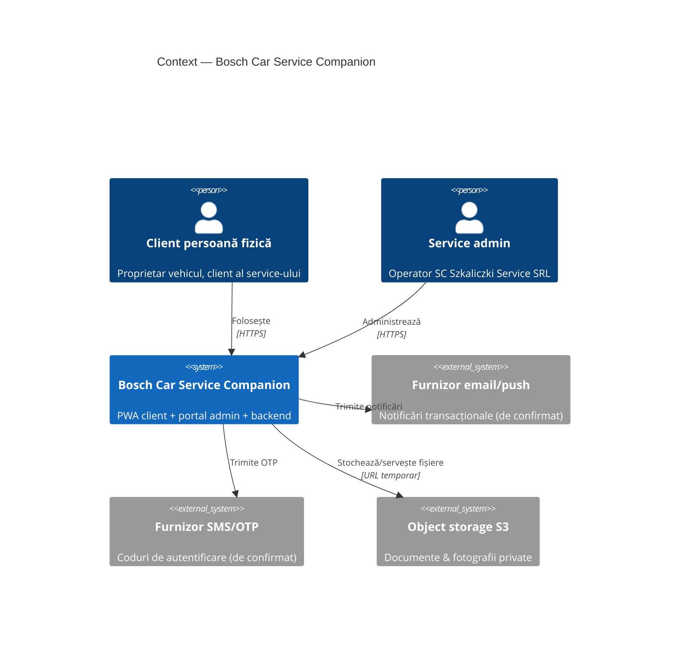
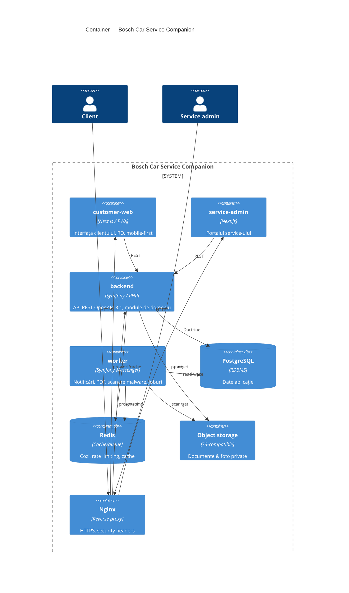
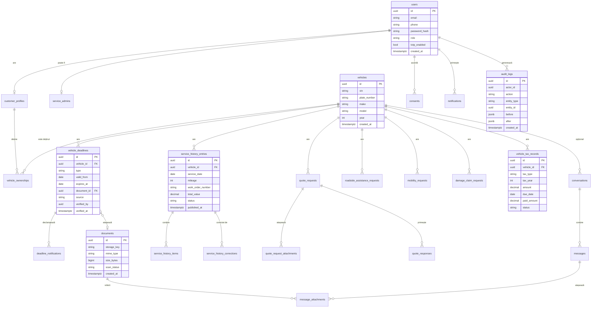

# Etapa 1 — Analiză și contract funcțional

**Proiect:** Bosch Car Service Companion
**Beneficiar:** SC SZKALICZKI SERVICE SRL (un singur Bosch Car Service)
**Model:** single-tenant · **Arhitectură:** modular monolith · **Limbă:** română

> Acest document este livrabilul obligatoriu al Etapei 1 din promptul de lucru.
> Nu conține implementare completă. La finalul etapei se cere aprobarea tehnică
> înainte de a trece la Etapa 2 (arhitectură detaliată).

---

## 1. Rezumatul înțelegerii proiectului

Construim o aplicație web/PWA în limba română pentru **clienții persoane fizice**
ai unui singur service auto (Bosch Car Service). Aplicația are trei suprafețe:

1. **Aplicația client** (PWA mobile-first) — clientul își vede vehiculele,
   scadențele (ITP, RCA, rovinietă, asistență rutieră), istoricul de service
   publicat, taxele anuale, și poate iniția solicitări (ofertă, asistență rutieră,
   mobilitate, dosar de daună) și conversații cu service-ul.
2. **Portalul service** (admin) — un operator al service-ului gestionează clienți,
   vehicule, validează scadențe, publică istoric, răspunde la solicitări și mesaje,
   schimbă stările conform tranzițiilor permise, consultă auditul.
3. **Backend + procese SYSTEM** — calcul stări de expirare, notificări, generare
   PDF, joburi de fundal, backup, monitorizare.

**Caracteristici esențiale:**
- **Single-tenant** — un singur service. Fără `tenant_id`, fără rețea/marketplace.
- Datele sunt strict izolate pe client (un client nu vede datele altui client).
- Stările de scadență se calculează pe **datele introduse și validate manual**;
  nu se pretinde interogare automată a bazelor oficiale (ITP/RCA/rovinietă).
- Documentele și fotografiile sunt **private**, servite prin URL-uri temporare.
- Valorile monetare se stochează **decimal**, niciodată `float`.

---

## 2. Ipoteze tehnice (max. 15)

| # | Ipoteză | Impact dacă e greșită |
|---|---------|------------------------|
| I1 | Autentificarea clientului se face prin **telefon + OTP** (cod SMS/WhatsApp) ca metodă principală; email+parolă rămâne alternativă. | Schimbă modulul Identity și fluxurile UI de login. |
| I2 | 2FA (TOTP) este obligatoriu **doar pentru SERVICE_ADMIN**, nu pentru client. | Efort suplimentar dacă și clientul necesită 2FA. |
| I3 | Numărul de admini ai service-ului este mic (1–5); nu e nevoie de matrice complexă de roluri în v1. | Necesită RBAC extins dacă apar multe roluri. |
| I4 | Notificările în v1 sunt **email + push (PWA)**; SMS/WhatsApp sunt integrări separate activate ulterior. | Cost și integrare provider extern. |
| I5 | Trimiterea OTP prin SMS necesită un provider (ex. furnizor SMS RO) — **de confirmat**; în dev folosim un transport fals (log). | Blochează login-ul prin telefon în producție. |
| I6 | Storage documente = S3-compatible; în local **MinIO**, în producție un bucket privat. | Schimbă adaptorul de storage (abstracție Flysystem). |
| I7 | Scanarea malware la upload = **ClamAV** rulat asincron (Messenger) înainte de a marca fișierul „curat”. | Alt engine sau serviciu extern. |
| I8 | Localizarea GPS pentru asistență rutieră se obține din browser cu **consimțământ explicit**; există fallback pe adresă manuală. | Fluxul roadside trebuie ajustat. |
| I9 | Pragurile de notificare (60/30/7/0/după) sunt **configurabile** din `application_settings`, cu valori implicite. | Hardcodare = refacere. |
| I10 | Un vehicul aparține **unui singur client** la un moment dat, prin `vehicle_ownerships` (istoric proprietari suportat, dar 1 activ). | Model de date diferit dacă e co-proprietate. |
| I11 | „Asistență rutieră” apare de două ori: ca **scadență** (valabilitate abonament) și ca **solicitare** (eveniment). Sunt module distincte. | Confuzie de domeniu dacă se unifică. |
| I12 | Generarea PDF (istoric service) se face server-side cu o bibliotecă PHP (ex. Dompdf/wkhtml) — de fixat în ADR. | Alegere de tooling. |
| I13 | Butonul WhatsApp este un **deep-link configurabil** (`wa.me/<număr>`), nu o integrare API WhatsApp Business. | Dacă se cere API oficial, e integrare separată. |
| I14 | Sesiunile folosesc **cookie httpOnly + CSRF**, nu JWT în localStorage, pentru securitate PWA. | Schimbă strategia de auth în frontend. |
| I15 | Fusul orar de afișare este `Europe/Bucharest`; stocarea în DB este `timestamptz` (UTC). | Erori de calcul scadențe la graniță de zi. |

---

## 3. Întrebări care blochează decizii reale

1. **OTP / SMS:** Există deja un contract cu un furnizor SMS pentru România?
   Dacă nu, acceptăm login principal prin **email + parolă** în v1 și amânăm
   OTP-ul prin telefon? *(blochează Identity)*
2. **Asistență rutieră – forwarding:** Către cine se „redirecționează” (FORWARDED)
   o solicitare roadside? Există un partener/furnizor concret sau rămâne doar
   marcaj intern + apel telefonic? *(blochează RoadsideAssistance)*
3. **WhatsApp:** Confirmăm ipoteza I13 (deep-link simplu) sau se dorește API oficial
   WhatsApp Business (integrare separată, cost, verificare Meta)?
4. **Notificări push în producție:** Web Push (VAPID) este suficient sau se dorește
   și email transacțional printr-un provider (ex. serviciu SMTP dedicat)?
5. **Date demo & identitate vizuală:** Primim logo-ul și paleta oficială a
   service-ului? (Nu reproducem asset-uri protejate fără aprobare.)
6. **Retenție & ștergere GDPR:** Ce categorii de date trebuie păstrate obligatoriu
   prin lege (ex. istoric fiscal) și pe ce durată? Necesar pentru politicile de
   retenție și excepțiile la „dreptul de ștergere”.
7. **Dosar de daună:** Colectăm date despre asigurător/poliță doar pentru asistență,
   fără nicio integrare cu asigurători — se confirmă că **nu** există brokeraj?
8. **Onboarding client:** Cine creează contul clientului — clientul singur
   (self-service) sau adminul îl invită? Impact asupra fluxului Identity.

> Până la răspunsuri, se adoptă ipotezele I1/I5 (email+parolă principal, OTP
> pregătit dar dezactivat) pentru a nu bloca dezvoltarea.

---

## 4. Perimetru — în perimetru / în afara perimetrului

| În perimetru (se implementează) | În afara perimetrului (interzis fără aprobare separată) |
|---|---|
| Aplicație client PWA (RO) | Arhitectură multi-tenant / `tenant_id` |
| Portal admin service (RO) | Mai multe service-uri pe platformă |
| Cele 11 funcționalități obligatorii | Rețea de service-uri / marketplace |
| Mesagerie client↔service | Modul de flotă / manager de flotă / raportare flotă |
| 4 tipuri de scadențe + notificări | Abonamente recurente / facturare SaaS |
| Istoric service cu corecții auditabile + PDF | Calcul de comisioane |
| Solicitări: ofertă, roadside, mobilitate, daună | Brokeraj / vânzare de asigurări |
| Taxe & impozite anuale (fără plată online) | Planificarea capacității atelierului |
| Documente private + URL-uri temporare | ERP / deviz intern / stocuri / gestiune piese |
| Audit, consimțăminte, export/rectificare/ștergere | Bază de cunoștințe tehnice |
| 2FA admin, rate limiting, security headers | Diagnostic asistat de AI |
| OpenAPI 3.1, teste, CI/CD, observabilitate | Copierea codului sursă anterior |

Orice cerință nouă care cade în coloana dreaptă se marchează **în afara
perimetrului** și nu intră în cod fără aprobare.

---

## 5. User journeys

### 5.1 Client



### 5.2 Service admin



---

## 6. Reguli de business și tranziții de stare

### 6.1 Conversații
`OPEN → WAITING_CLIENT | WAITING_SERVICE → CLOSED` (redeschidere permisă din CLOSED).

### 6.2 Scadențe (stare calculată, nu stocată ca sursă de adevăr)
Tip: `ITP | RCA | ROAD_TAX | ROADSIDE_ASSISTANCE`.
Stare derivată din `expires_at` și praguri configurabile:

```text
UNKNOWN   → nu există dată validă
VALID     → expires_at - azi > prag DUE_SOON
DUE_SOON  → 0 < zile rămase ≤ prag (implicit 60/30/7)
EXPIRED   → azi > expires_at
```

Praguri de notificare implicite (configurabile): **60, 30, 7, 0 (ziua), după expirare**.

### 6.3 Istoric service
`DRAFT → PUBLISHED → CORRECTED`. O intrare `PUBLISHED` **nu** se șterge și nu se
suprascrie; corecția este obiect separat; auditul păstrează versiunea anterioară,
actorul, data și motivul. Clientul vede doar `PUBLISHED` (și corecțiile publicate).

### 6.4 Solicitare ofertă
```text
DRAFT → SUBMITTED → IN_REVIEW
IN_REVIEW → NEEDS_INFORMATION | REPLIED | CLOSED
NEEDS_INFORMATION → IN_REVIEW | CLOSED
REPLIED → ACCEPTED | DECLINED | CLOSED
ACCEPTED → CLOSED ; DECLINED → CLOSED
```

### 6.5 Asistență rutieră (solicitare)
`SUBMITTED → VALIDATED → FORWARDED → IN_PROGRESS → COMPLETED`; `CANCELLED` din orice
stare ne-terminală. UI: buton apel rapid, confirmare, avertisment „nu înlocuiește 112”.

### 6.6 Mobilitate
`SUBMITTED → IN_REVIEW → CONTACTED → CONFIRMED → COMPLETED`; ramuri `UNAVAILABLE`,
`CANCELLED`.

### 6.7 Dosar de daună
`SUBMITTED → DOCUMENTS_MISSING → IN_REVIEW → CONTACTED → FILE_OPENED → CLOSED`.
Modul de **asistență și colectare de date**, nu sistem de daună/brokeraj.

### 6.8 Taxe anuale
`UNPAID → PARTIALLY_PAID → PAID`; `OVERDUE` când `due_date < azi` și nu e `PAID`.
Sume decimale; fără plată online.

**Regulă transversală:** fiecare tranziție trece prin `TransitionGuard` (mașină de
stare centralizată) + verificare de autorizare la nivel de obiect + scriere în audit.

---

## 7. C4 — Context și Container (Mermaid)

### 7.1 Context



### 7.2 Container



---

## 8. Model ERD inițial (Mermaid)



> ERD complet (toate tabelele din modelul de date minim) în
> `docs/data-model/erd.md`.

---

## 9. Endpoint-uri grupate pe module

| Modul | Endpoint-uri |
|---|---|
| **Identity** | `POST /api/auth/login` · `POST /api/auth/request-code` · `POST /api/auth/verify-code` · `POST /api/auth/logout` · `GET /api/me` |
| **Vehicle** | `GET/POST /api/vehicles` · `GET/PATCH /api/vehicles/{id}` |
| **Deadline** | `GET/POST /api/vehicles/{id}/deadlines` · `PATCH /api/deadlines/{id}` · `POST /api/deadlines/{id}/documents` |
| **ServiceHistory** | `GET /api/vehicles/{id}/service-history` · `GET /api/service-history/{id}` · `POST /api/admin/service-history` · `POST /api/admin/service-history/{id}/corrections` |
| **QuoteRequest** | `GET/POST /api/quote-requests` · `GET /api/quote-requests/{id}` · `POST /api/admin/quote-requests/{id}/response` · `PATCH /api/admin/quote-requests/{id}/status` |
| **RoadsideAssistance** | `GET/POST /api/roadside-requests` · `PATCH /api/admin/roadside-requests/{id}/status` |
| **Mobility** | `GET/POST /api/mobility-requests` · `PATCH /api/admin/mobility-requests/{id}/status` |
| **DamageClaim** | `GET/POST /api/damage-claim-requests` · `PATCH /api/admin/damage-claim-requests/{id}/status` |
| **Communication** | `GET/POST /api/conversations` · `GET/POST /api/conversations/{id}/messages` |
| **Tax** | `GET/POST /api/vehicles/{id}/taxes` · `PATCH/DELETE /api/taxes/{id}` |
| **Document** | `POST /api/documents` · `GET /api/documents/{id}/download-url` |
| **System** | `GET /api/health` · `GET /api/health/ready` |

Contractul complet: `docs/api/openapi.yaml`.

---

## 10. Plan de implementare pe sprinturi

| Sprint | Livrabile | Module |
|---|---|---|
| **S0 — Fundație** *(acest scaffold)* | Docker, CI/CD, schema erori, health, OpenAPI skeleton, ADR-uri, ERD | Infra + Shared |
| **S1** | Autentificare, profil, vehicule; audit + documente + notificări (schelet) | Identity, Customer, Vehicle, Document, Audit, Notification |
| **S2** | Cele 4 scadențe + calcul stări + notificări pe praguri | Deadline, Notification |
| **S3** | Istoric service + corecții + PDF | ServiceHistory, Document |
| **S4** | Solicitare ofertă (flux complet client↔admin) | QuoteRequest |
| **S5** | Asistență rutieră + mobilitate | RoadsideAssistance, Mobility |
| **S6** | Dosar de daună + taxe anuale | DamageClaim, Tax |
| **S7** | Comunicare (mesagerie completă) + WhatsApp deep-link | Communication |
| **S8 — Stabilizare** | GDPR (export/rectificare/ștergere/retenție), backup+restore testat, audit de securitate, E2E, observabilitate | Settings, Audit, toate |

Pentru fiecare modul: migrație · entitate · servicii de domeniu · controller/API ·
autorizare · frontend client · frontend admin · teste · documentație · date demo ·
checklist de acceptanță.

---

## 11. Riscuri principale și măsuri de control

| Risc | Impact | Măsură de control |
|---|---|---|
| Dependență de furnizori externi neconfirmați (SMS/email/push) | Blochează login/notificări | Abstracție `NotifierInterface`/`OtpSenderInterface`; transport fals în dev; activare după contract |
| Scurgere de date între clienți (IDOR) | Critic (GDPR) | Autorizare la nivel de obiect (Voters), teste de autorizare între clienți obligatorii în DoD |
| Upload de fișiere malițioase | Securitate | Validare MIME+extensie, limită dimensiune, scanare ClamAV asincronă, marcaj `scan_status` înainte de servire |
| Calcul greșit al scadențelor la graniță de fus orar | Notificări eronate | Stocare `timestamptz` UTC, calcul cu `Europe/Bucharest`, teste unitare pe cazuri de graniță |
| „Scope creep” către funcții interzise (flotă, ERP, brokeraj) | Buget/timp | Tabel perimetru în `docs/legal-separation`, marcaj explicit „în afara perimetrului”, gate la review |
| Confuzie istoric service ↔ „istoric național VIN” | Legal/așteptări | Text UI explicit: istoricul începe de la prima intrare în service |
| Pierdere de date | Critic | Backup zilnic + procedură de restaurare **testată**, alerte la backup eșuat |
| Copierea accidentală a codului din demo-ul anterior | Contractual | Cod nou, review; demo folosit doar ca referință vizuală |
| Neconformitate GDPR de formă | Legal | Evidența consimțămintelor, export/rectificare/ștergere reale, politici de retenție configurabile |

---

## Cerere de aprobare (gate Etapa 1 → Etapa 2)

Solicit confirmarea:
1. ipotezelor I1–I15 (în special I1/I5 despre metoda de autentificare);
2. răspunsurilor la cele 8 întrebări blocante;
3. tabelului de perimetru.

După aprobare, Etapa 2 livrează: ADR-uri finalizate, ERD complet, strategie de
securitate & backup, plan de medii și CI/CD detaliat.
