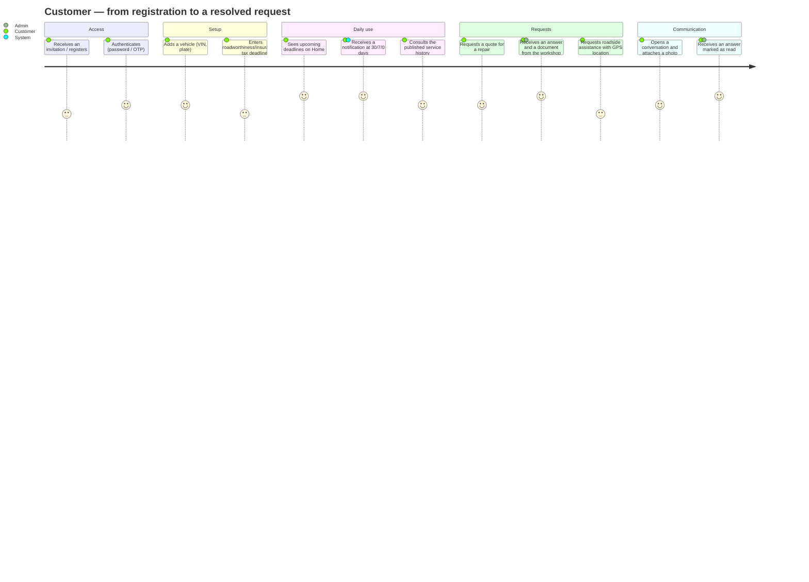
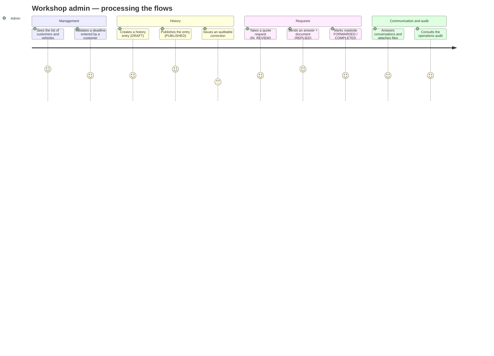
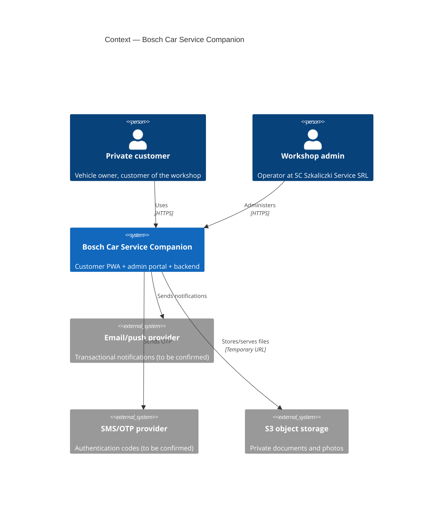
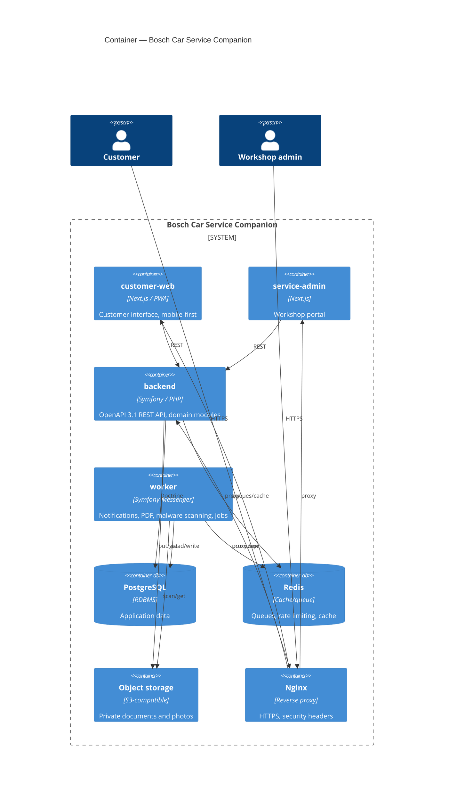

# Stage 1 — Analysis and functional contract

**Project:** Bosch Car Service Companion
**Client:** SC SZKALICZKI SERVICE SRL (a single Bosch Car Service)
**Model:** single-tenant · **Architecture:** modular monolith

> **This is a historical document.** It is the Stage 1 deliverable, written
> before implementation, and it is kept for the reasoning it records — the
> assumptions, the blocking questions, and the scope boundary.
>
> **Several assumptions resolved differently in the delivered system.**
> Section 12 at the end records how each one turned out. For what the system
> actually does today, read [Architecture](../ARCHITECTURE.md) and
> [Feature behaviour](../PILOT_READINESS.md).

---

## 1. Summary of the project

A Romanian-language web/PWA application for the **private-individual customers**
of a single car workshop (Bosch Car Service). It has three surfaces:

1. **The customer application** (mobile-first PWA) — customers see their
   vehicles, deadlines (roadworthiness test, insurance, road tax, roadside
   assistance), published service history and annual taxes, and can raise
   requests (quote, roadside assistance, mobility, damage claim) and
   conversations with the workshop.
2. **The workshop portal** (admin) — a workshop operator manages customers and
   vehicles, validates deadlines, publishes history, answers requests and
   messages, changes states according to the permitted transitions, and consults
   the audit log.
3. **Backend and SYSTEM processes** — expiry state calculation, notifications,
   PDF generation, background jobs, backup, monitoring.

**Essential characteristics:**

- **Single-tenant** — one workshop. No `tenant_id`, no network or marketplace.
- Data is strictly isolated per customer (one customer never sees another's).
- Deadline states are computed from **manually entered and validated data**; the
  system does not claim to query official databases automatically.
- Documents and photos are **private**, served through temporary URLs.
- Monetary values are stored as **decimal**, never `float`.

---

## 2. Technical assumptions

| # | Assumption | Impact if wrong |
|---|---|---|
| I1 | Customer authentication uses **phone + OTP** (SMS/WhatsApp code) as the primary method; email + password remains an alternative. | Changes the Identity module and the login UI flows. |
| I2 | TOTP 2FA is mandatory **only for SERVICE_ADMIN**, not for customers. | Extra effort if customers also need 2FA. |
| I3 | The number of workshop admins is small (1-5); no complex role matrix is needed in v1. | Requires extended RBAC if many roles appear. |
| I4 | Notifications in v1 are **email + push (PWA)**; SMS/WhatsApp are separate integrations enabled later. | Cost and external provider integration. |
| I5 | Sending OTP by SMS requires a provider — **to be confirmed**; in development a fake transport (log) is used. | Blocks phone login in production. |
| I6 | Document storage is S3-compatible; **MinIO** locally, a private bucket in production. | Changes the storage adapter. |
| I7 | Malware scanning on upload is **ClamAV**, run asynchronously (Messenger) before marking a file clean. | A different engine or external service. |
| I8 | GPS location for roadside assistance comes from the browser with **explicit consent**; there is a manual address fallback. | The roadside flow must be adjusted. |
| I9 | Notification thresholds (60/30/7/0/after) are **configurable** from `application_settings`, with defaults. | Hardcoding means rework. |
| I10 | A vehicle belongs to **one customer** at a time, through `vehicle_ownerships` (owner history supported, one active). | A different data model if co-ownership is required. |
| I11 | "Roadside assistance" appears twice: as a **deadline** (subscription validity) and as a **request** (an event). They are distinct modules. | Domain confusion if unified. |
| I12 | Server-side PDF generation (service history) with a PHP library, to be fixed in an ADR. | A tooling choice. |
| I13 | The WhatsApp button is a **configurable deep link** (`wa.me/<number>`), not a WhatsApp Business API integration. | A separate integration if the official API is required. |
| I14 | Sessions use an **httpOnly cookie + CSRF**, not a JWT in localStorage, for PWA security. | Changes the frontend auth strategy. |
| I15 | The display timezone is `Europe/Bucharest`; storage is `timestamptz` (UTC). | Deadline calculation errors at day boundaries. |

---

## 3. Questions blocking real decisions

1. **OTP / SMS:** Is there already a contract with an SMS provider for Romania?
   If not, do we accept **email + password** as the primary login in v1 and defer
   phone OTP? *(blocks Identity)*
2. **Roadside assistance — forwarding:** Who is a roadside request "forwarded"
   to? Is there a concrete partner, or does it remain an internal marker plus a
   phone call? *(blocks Roadside)*
3. **WhatsApp:** Do we confirm assumption I13 (a simple deep link), or is the
   official WhatsApp Business API wanted (separate integration, cost, Meta
   verification)?
4. **Push notifications in production:** Is Web Push (VAPID) sufficient, or is
   transactional email through a provider also wanted?
5. **Demo data and visual identity:** Do we receive the workshop's logo and
   official palette? (We do not reproduce protected assets without approval.)
6. **GDPR retention and erasure:** Which data categories must be retained by law
   (for example fiscal history) and for how long? Needed for the retention
   policies and the exceptions to the right to erasure.
7. **Damage claim:** We collect insurer and policy data purely for assistance,
   with no insurer integration — is it confirmed there is **no** brokerage?
8. **Customer onboarding:** Who creates the customer's account — the customer
   (self-service) or an admin invitation? Affects the Identity flow.

> Until answered, assumptions I1/I5 are adopted (email + password primary, OTP
> prepared but disabled) so development is not blocked.

---

## 4. Scope — in and out

| In scope (implemented) | Out of scope (forbidden without separate approval) |
|---|---|
| Customer PWA | Multi-tenant architecture / `tenant_id` |
| Workshop admin portal | Multiple workshops on the platform |
| The 11 mandatory features | Workshop network / marketplace |
| Customer ↔ workshop messaging | Fleet module / fleet manager / fleet reporting |
| 4 deadline types + notifications | Recurring subscriptions / SaaS billing |
| Service history with auditable corrections + PDF | Commission calculation |
| Requests: quote, roadside, mobility, damage | Insurance brokerage or sales |
| Annual taxes and duties (no online payment) | Workshop capacity planning |
| Private documents + temporary URLs | ERP / internal estimates / stock / parts |
| Audit, consents, export/rectification/erasure | Technical knowledge base |
| Admin 2FA, rate limiting, security headers | AI-assisted diagnostics |
| OpenAPI 3.1, tests, CI/CD, observability | Copying the previous source code |

Any new requirement falling in the right-hand column is marked **out of scope**
and does not enter the codebase without approval. See
[the scope document](../legal-separation/scope.md).

---

## 5. User journeys

### 5.1 Customer



### 5.2 Workshop admin



---

## 6. Business rules and state transitions

These are implemented and current.

### 6.1 Conversations
`OPEN → WAITING_CLIENT | WAITING_SERVICE → CLOSED` (reopening from CLOSED is
permitted).

### 6.2 Deadlines (a computed state, not stored as the source of truth)
Type: `ITP | RCA | ROAD_TAX | ROADSIDE_ASSISTANCE`. State derived from
`expires_at` and configurable thresholds:

```text
UNKNOWN   → no valid date
VALID     → expires_at - today > the DUE_SOON threshold
DUE_SOON  → 0 < days remaining ≤ threshold (default 60/30/7)
EXPIRED   → today > expires_at
```

Default notification thresholds (configurable): **60, 30, 7, 0 (the day), and
after expiry**.

### 6.3 Service history
`DRAFT → PUBLISHED → CORRECTED`. A `PUBLISHED` entry is **never** deleted or
overwritten; a correction is a separate object, and the audit keeps the previous
version, the actor, the date and the reason. Customers see only `PUBLISHED`
entries and published corrections.

### 6.4 Quote request
```text
DRAFT → SUBMITTED → IN_REVIEW
IN_REVIEW → NEEDS_INFORMATION | REPLIED | CLOSED
NEEDS_INFORMATION → IN_REVIEW | CLOSED
REPLIED → ACCEPTED | DECLINED | CLOSED
ACCEPTED → CLOSED ; DECLINED → CLOSED
```

### 6.5 Roadside assistance (request)
`SUBMITTED → VALIDATED → FORWARDED → IN_PROGRESS → COMPLETED`; `CANCELLED` from
any non-terminal state. UI: a quick-call button, a confirmation, and a warning
that it does not replace the emergency number 112.

### 6.6 Mobility
`SUBMITTED → IN_REVIEW → CONTACTED → CONFIRMED → COMPLETED`; with `UNAVAILABLE`
and `CANCELLED` branches.

### 6.7 Damage claim
`SUBMITTED → DOCUMENTS_MISSING → IN_REVIEW → CONTACTED → FILE_OPENED → CLOSED`.
An **assistance and data-collection** module, not a claims or brokerage system.

### 6.8 Annual taxes
`UNPAID → PARTIALLY_PAID → PAID`; `OVERDUE` when `due_date < today` and not
`PAID`. Decimal amounts; no online payment.

**Cross-cutting rule:** every transition goes through a `TransitionGuard` (a
centralised state machine) plus an object-level authorisation check, and is
written to the audit log.

---

## 7. C4 — Context and Container

### 7.1 Context



> As delivered, neither external provider exists: notifications stop at
> `MANUAL_ACTION_REQUIRED` and OTP is disabled. See section 12.

### 7.2 Container



> The delivered topology differs: Caddy terminates TLS at the edge and nginx sits
> only in front of the backend, and the browser reaches the API through the
> Next.js server rather than directly. See
> [Architecture §1](../ARCHITECTURE.md).

---

## 8. Initial ERD

The draft ERD that lived here has been removed rather than translated: it had
drifted from the implemented schema and referenced tables that do not exist
(`service_history_entries`, `vehicle_tax_records`,
`roadside_assistance_requests`, `quote_request_attachments`).

The accurate model, generated from the live database, is in
[`../data-model/erd.md`](../data-model/erd.md).

---

## 9. Endpoints grouped by module

The list originally here was a design sketch and several paths changed during
implementation. The authoritative contract is
[`../api/openapi.yaml`](../api/openapi.yaml), which is kept in sync with the
router and enforced by `OpenApiSyncTest`. A current summary of the route groups
is in [`../../backend/src/README.md`](../../backend/src/README.md).

---

## 10. Sprint plan

| Sprint | Deliverables | Modules |
|---|---|---|
| **S0 — Foundation** | Docker, CI/CD, error schema, health, OpenAPI skeleton, ADRs, ERD | Infra + Shared |
| **S1** | Authentication, profile, vehicles; audit + documents + notifications (skeleton) | Identity, Customer, Vehicle, Document, Audit, Notification |
| **S2** | The 4 deadlines + state calculation + threshold notifications | Deadline, Notification |
| **S3** | Service history + corrections + PDF | ServiceHistory, Document |
| **S4** | Quote request (full customer ↔ admin flow) | QuoteRequest |
| **S5** | Roadside assistance + mobility | Roadside, Mobility |
| **S6** | Damage claim + annual taxes | DamageClaim, Tax |
| **S7** | Communication (full messaging) + WhatsApp deep link | Communication |
| **S8 — Stabilisation** | GDPR (export/rectification/erasure/retention), tested backup + restore, security audit, E2E, observability | Settings, Audit, all |

All sprints are delivered. For each module: migration · entity · domain services
· controller/API · authorisation · customer frontend · admin frontend · tests ·
documentation · demo data · acceptance checklist.

---

## 11. Main risks and controls

| Risk | Impact | Control |
|---|---|---|
| Dependency on unconfirmed external providers (SMS/email/push) | Blocks login/notifications | Abstractions `NotificationDelivery` / `OtpSenderInterface`; fake transport in dev; enabled once contracted |
| Data leaking between customers (IDOR) | Critical (GDPR) | Object-level authorisation (Voters); cross-customer authorisation tests mandatory in the definition of done |
| Malicious file uploads | Security | MIME + extension validation, size limit, asynchronous ClamAV scan, `scan_status` checked before serving |
| Incorrect deadline calculation at timezone boundaries | Wrong notifications | `timestamptz` UTC storage, calculation in `Europe/Bucharest`, unit tests on boundary cases |
| Scope creep towards forbidden features (fleet, ERP, brokerage) | Budget/time | The scope table in `docs/legal-separation`, an explicit "out of scope" marker, a review gate |
| Confusing service history with a "national VIN history" | Legal/expectations | Explicit UI text: history starts from the first visit to this workshop |
| Data loss | Critical | Daily backup + a **tested** restore procedure, alerts on backup failure |
| Accidentally copying code from the previous demo | Contractual | New code, review; the demo used only as a visual reference |
| Formal GDPR non-compliance | Legal | Consent records, real export/rectification/erasure, configurable retention policies |

The data-loss control deserves a footnote: it was implemented, but the restore
was not actually exercised until 2026-08-11 — at which point it turned out the
backups had been empty for seven nights. See
[Backup and restore](../BACKUP_AND_RESTORE.md). The control was correct; only
verifying it made it real.

---

## 12. How the assumptions actually resolved

Recorded 2026-08-11, comparing this document against the delivered system.

| # | Assumption | Outcome |
|---|---|---|
| I1 | Phone + OTP as the primary login | **Changed.** Email + password is the only customer method. OTP stays behind `OtpSenderInterface`, disabled. See [ADR-0002](../architecture/adr/0002-authentication.md) |
| I2 | TOTP 2FA for SERVICE_ADMIN only | **Held**, and enforced in production — `/api/admin` is blocked until enrolment |
| I3 | Few admins, no role matrix | **Held** |
| I4 | Notifications by email + push | **Not delivered.** No provider exists; notifications stop at `MANUAL_ACTION_REQUIRED`. The largest remaining gap — see [Roadmap](../ROADMAP.md) |
| I5 | SMS provider to be confirmed | **Never contracted.** Phone OTP remains disabled |
| I6 | S3-compatible storage, MinIO locally | **Held.** MinIO in production too; real AWS S3 remains unvalidated |
| I7 | Asynchronous ClamAV scanning | **Held**, and fail-closed — an unreachable scanner rejects the upload |
| I8 | Browser GPS with consent, manual fallback | **Held** |
| I9 | Configurable notification thresholds | **Held** (`application_settings`) |
| I10 | One active owner per vehicle | **Held** (`vehicle_ownerships`, transfer closes the previous row) |
| I11 | Roadside as both a deadline and a request | **Held** — separate modules |
| I12 | Server-side PDF generation | **Held** |
| I13 | WhatsApp as a deep link | **Held** — no Business API |
| I14 | httpOnly cookie + CSRF, no JWT | **Held** |
| I15 | `Europe/Bucharest` display, UTC storage | **Held** |

And the blocking questions:

| # | Question | Resolution |
|---|---|---|
| 1 | SMS provider? | No. Email + password adopted; OTP deferred |
| 2 | Roadside forwarding target? | Internal marker plus a phone call; no external partner |
| 3 | WhatsApp deep link or API? | Deep link |
| 4 | Push and/or transactional email? | Neither implemented — still open |
| 5 | Logo and palette? | Project tokens used (`--primary` `#0a2540`); no protected assets reproduced |
| 6 | GDPR retention categories? | Resolved — see [the retention policy](../security/data-retention-policy.md) |
| 7 | Damage claim brokerage? | Confirmed: no brokerage, data collection only |
| 8 | Who creates the customer account? | Open self-registration, with vehicle linking by an activation code issued by the workshop |

Question 8's answer is worth noting: the delivered design is stronger than either
option offered. A plate or VIN alone never grants access — see
[Feature behaviour, Block 3](../PILOT_READINESS.md).
