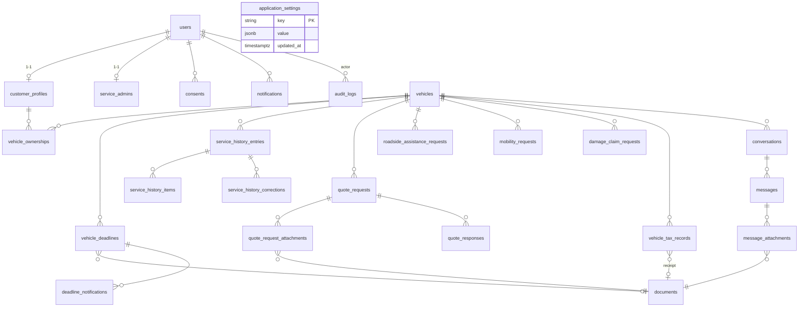

# Model de date — ERD complet

Cerințe transversale:
- **UUID** pentru identificatorii expuși extern;
- `timestamptz` consistente (UTC în DB, afișare `Europe/Bucharest`);
- soft delete **numai unde este justificat** (ex. `documents`, `service_history_entries`);
- foreign keys reale;
- indexuri pe `vehicle_id`, `customer_id`, `status`, `expires_at`, `created_at`;
- constrângeri CHECK pentru sume (`>= 0`) și date (`expires_at > valid_from`);
- **VIN** validat ca format și normalizat uppercase;
- valorile monetare `numeric(12,2)` — niciodată `float`.

## Tabele (rezumat coloane-cheie)

### Identity & Customer
- **users**(`id uuid pk`, `email`, `phone`, `password_hash`, `role`, `totp_secret`,
  `totp_enabled bool`, `is_active bool`, `created_at`, `updated_at`)
- **customer_profiles**(`id uuid pk`, `user_id fk`, `first_name`, `last_name`,
  `phone`, `address`, `created_at`)
- **service_admins**(`id uuid pk`, `user_id fk`, `display_name`, `created_at`)

### Vehicle
- **vehicles**(`id uuid pk`, `vin` *(uppercase, validat)*, `plate_number`, `make`,
  `model`, `year`, `created_at`, `updated_at`, `deleted_at?`)
- **vehicle_ownerships**(`id uuid pk`, `vehicle_id fk`, `customer_profile_id fk`,
  `active bool`, `from`, `to?`) — un singur `active=true` per vehicul.

### Communication
- **conversations**(`id uuid pk`, `customer_profile_id fk`, `vehicle_id fk?`,
  `subject`, `status` `[OPEN|WAITING_CLIENT|WAITING_SERVICE|CLOSED]`, `created_at`)
- **messages**(`id uuid pk`, `conversation_id fk`, `sender_user_id fk`, `body`,
  `read_at?`, `created_at`)
- **message_attachments**(`id uuid pk`, `message_id fk`, `document_id fk`)

### Deadline
- **vehicle_deadlines**(`id uuid pk`, `vehicle_id fk`, `type`
  `[ITP|RCA|ROAD_TAX|ROADSIDE_ASSISTANCE]`, `valid_from date`, `expires_at date`,
  `document_id fk?`, `source` `[CLIENT|SERVICE|IMPORT]`, `verified_by uuid?`,
  `verified_at?`, `note`, `created_at`, `updated_at`) — CHECK `expires_at > valid_from`.
- **deadline_notifications**(`id uuid pk`, `deadline_id fk`, `threshold_days int`,
  `sent_at`, `channel`)

### ServiceHistory
- **service_history_entries**(`id uuid pk`, `vehicle_id fk`, `service_date date`,
  `mileage int`, `work_order_number`, `category`, `work_summary`, `parts_summary`,
  `labor_value numeric(12,2)`, `total_value numeric(12,2)`, `warranty_until date?`,
  `warranty_text?`, `status` `[DRAFT|PUBLISHED|CORRECTED]`, `created_by fk`,
  `published_at?`, `created_at`, `deleted_at?`)
- **service_history_items**(`id uuid pk`, `entry_id fk`, `description`,
  `quantity`, `unit_value numeric(12,2)`)
- **service_history_corrections**(`id uuid pk`, `entry_id fk`, `previous_snapshot jsonb`,
  `reason`, `corrected_by fk`, `created_at`)

### QuoteRequest
- **quote_requests**(`id uuid pk`, `vehicle_id fk`, `mileage`, `symptom_description`,
  `occurrence_conditions`, `vehicle_drivable bool`, `warning_lights`,
  `preferred_contact_method`, `preferred_interval`, `status`, `created_at`)
- **quote_request_attachments**(`id uuid pk`, `quote_request_id fk`, `document_id fk`)
- **quote_responses**(`id uuid pk`, `quote_request_id fk`, `body`, `document_id fk?`,
  `created_by fk`, `created_at`)

### Requests (roadside / mobility / damage)
- **roadside_assistance_requests**(`id uuid pk`, `vehicle_id fk`, `latitude?`,
  `longitude?`, `manual_address?`, `issue_type`, `issue_description`,
  `vehicle_drivable bool`, `safe_location bool`, `passenger_count`, `contact_phone`,
  `status`, `forwarded_provider?`, `created_at`)
- **mobility_requests**(`id uuid pk`, `vehicle_id fk`, `mobility_type`
  `[REPLACEMENT_CAR|TAXI|PERSON_TRANSPORT|ACCOMMODATION|OTHER]`, `location`,
  `requested_at`, `passenger_count`, `note`, `contact_phone`, `status`)
- **damage_claim_requests**(`id uuid pk`, `vehicle_id fk`, `event_date_time`,
  `location`, `event_description`, `other_party_data jsonb`, `insurer`,
  `policy_number`, `police_document_id fk?`, `amicable_report_id fk?`,
  `contact_phone`, `status`, `missing_documents jsonb`, `created_at`)

### Tax
- **vehicle_tax_records**(`id uuid pk`, `vehicle_id fk`, `tax_type`, `tax_year int`,
  `amount numeric(12,2)`, `due_date date`, `paid_amount numeric(12,2)`, `paid_at?`,
  `receipt_document_id fk?`, `note`, `status` `[UNPAID|PARTIALLY_PAID|PAID|OVERDUE]`)
  — CHECK `amount >= 0`, `paid_amount >= 0`.

### Cross-cutting
- **documents**(`id uuid pk`, `storage_key`, `original_name`, `mime_type`,
  `size_bytes bigint`, `scan_status` `[PENDING|CLEAN|INFECTED]`, `owner_user_id fk`,
  `created_at`, `deleted_at?`)
- **consents**(`id uuid pk`, `user_id fk`, `type`, `granted bool`, `text_version`,
  `granted_at`, `revoked_at?`)
- **notifications**(`id uuid pk`, `user_id fk`, `type`, `payload jsonb`, `channel`,
  `read_at?`, `sent_at?`, `created_at`)
- **audit_logs**(`id uuid pk`, `actor_id uuid?`, `action`, `entity_type`,
  `entity_id uuid?`, `before jsonb?`, `after jsonb?`, `ip?`, `created_at`)
- **application_settings**(`key pk`, `value jsonb`, `updated_at`) — praguri
  notificare, texte confidențialitate, număr WhatsApp, politici retenție.
