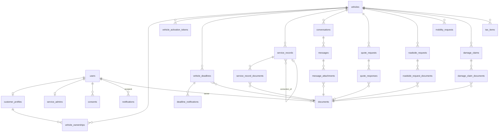

# Data model

26 tables, 20 migrations. **This diagram is generated from the live schema**
(`information_schema` foreign keys, 2026-08-11), not hand-maintained — an earlier
version had drifted and listed tables that no longer existed
(`service_history_entries`, `vehicle_tax_records`, `roadside_assistance_requests`).

If you change the schema, regenerate rather than edit by hand:

```bash
docker compose --env-file .env.prod -f compose.prod.yaml exec -T db psql -U bcsc -d bcsc -c "
SELECT tc.table_name, kcu.column_name, ccu.table_name AS references
FROM information_schema.table_constraints tc
JOIN information_schema.key_column_usage kcu ON tc.constraint_name = kcu.constraint_name
JOIN information_schema.constraint_column_usage ccu ON ccu.constraint_name = tc.constraint_name
WHERE tc.constraint_type = 'FOREIGN KEY' AND tc.table_schema = 'public'
ORDER BY 1, 2;"
```

---

## Cross-cutting requirements

- **UUID** for externally exposed identifiers.
- Consistent `timestamptz` (UTC in the database, displayed as `Europe/Bucharest`).
- Soft delete **only where justified** (for example `documents`).
- Real foreign keys.
- Indexes on `vehicle_id`, `customer_id`, `status`, `expires_at`, `created_at`.
- CHECK constraints for amounts (`>= 0`) and dates (`expires_at > valid_from`).
- **VIN** validated for format and normalised to uppercase; unique at the
  database level.
- Monetary values `numeric(12,2)` — never `float`.

Hand-written migrations must use Doctrine's foreign-key index naming,
`IDX_<crc32(table)><crc32(column)>`. See
[Troubleshooting §10](../TROUBLESHOOTING.md).

## Entity relationships



`audit_logs` and `application_settings` stand apart: `audit_logs` records an
actor plus before/after values for any entity, and `application_settings` is a
key/value store.

## Tables by module

### Identity and customer

| Table | Purpose |
|---|---|
| `users` | Accounts: email, password hash, role, TOTP secret and enabled flag, active flag |
| `customer_profiles` | Customer name, phone, address — one per user |
| `service_admins` | Workshop staff — one per user |
| `consents` | GDPR consent records, with the text version |

### Vehicles

| Table | Purpose |
|---|---|
| `vehicles` | Plate, VIN (unique), make, model, year |
| `vehicle_ownerships` | Links a `customer_profile` to a vehicle; closed with `active=false` rather than deleted |
| `vehicle_activation_tokens` | Single-use hashed activation codes, with expiry and an attempt limit |

### Deadlines

| Table | Purpose |
|---|---|
| `vehicle_deadlines` | Roadworthiness / insurance / road tax / assistance, with validity dates, an optional supporting document, and who verified it |
| `deadline_notifications` | Which threshold notification has been emitted for which deadline |

### Service history

| Table | Purpose |
|---|---|
| `service_records` | Repair records; a correction points at the original via `correction_of_id`, so nothing is lost |
| `service_record_documents` | Join table to `documents` |

### Communication and requests

| Table | Purpose |
|---|---|
| `conversations`, `messages`, `message_attachments` | Threads between customer and workshop |
| `quote_requests`, `quote_responses` | Quote requests with a state machine, and the workshop's answers |
| `roadside_requests`, `roadside_request_documents` | Roadside assistance |
| `mobility_requests` | Replacement-vehicle requests |
| `damage_claims`, `damage_claim_documents` | Damage claim files |
| `tax_items` | Annual taxes and duties, declarative payment state |

### Cross-cutting

| Table | Purpose |
|---|---|
| `documents` | Metadata only — filename, MIME, size, `scan_status`, owner. Content lives in object storage, never in the database |
| `notifications` | In-app notification records, plus who sent them manually |
| `audit_logs` | Actor, timestamp, before/after, reason |
| `application_settings` | Key/value (`jsonb`) — thresholds, texts, upload limits |
| `messenger_messages` | The Doctrine Messenger transport, created by migration `Version20260715234015` and **not** by Messenger's `auto_setup` |

## Notes on specific decisions

**Customer-owned rows reference `users`, not `customer_profiles`.** Requests
(`quote_requests`, `roadside_requests`, `mobility_requests`, `damage_claims`,
`tax_items`, `conversations`) carry a `customer_id` pointing at `users`. Only
`vehicle_ownerships` goes through `customer_profiles`.

**Documents are referenced through join tables** (`*_documents`) rather than a
polymorphic column, so foreign keys stay real and cascade behaviour is explicit.

**Service corrections are self-referential.** A correction is a new
`service_records` row whose `correction_of_id` points at the original; the
original stays visible, marked as corrected.

**GDPR anonymisation keeps vehicles and history.** On purge, the ownership link
is closed and personal fields are anonymised, but the workshop's operational
record survives — see [the retention policy](../security/data-retention-policy.md).
